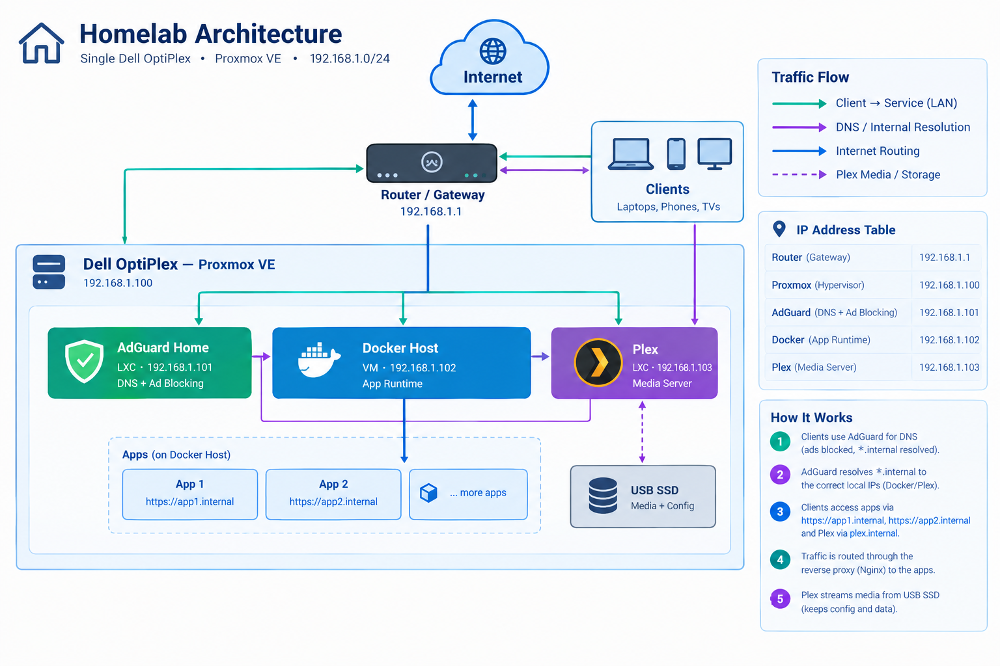
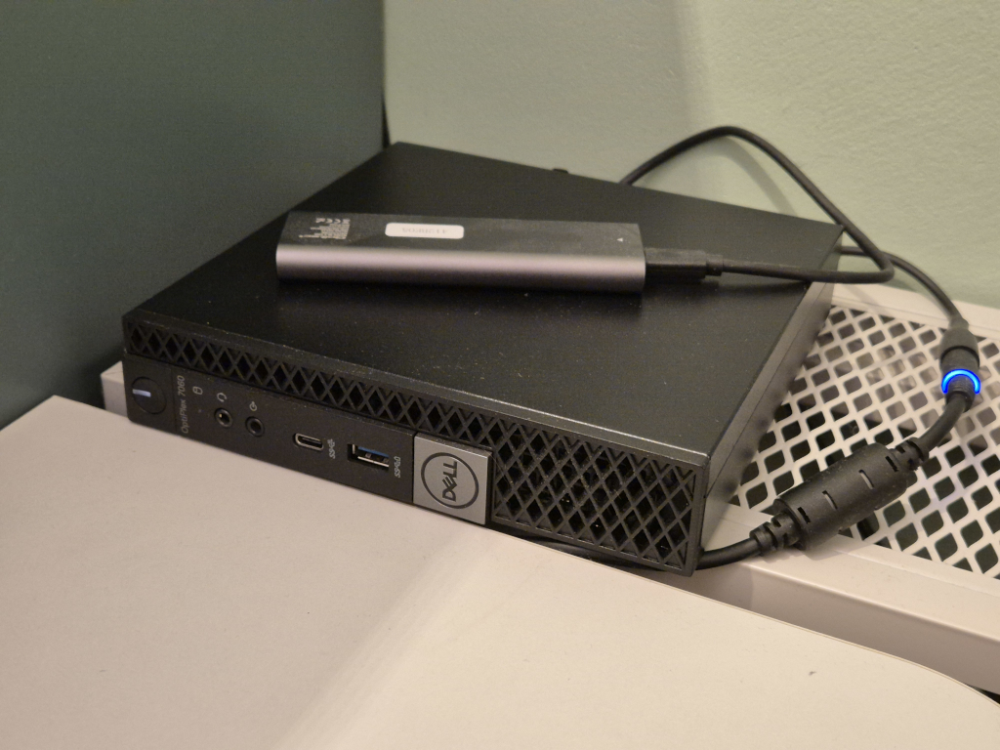

# Homelab
<p align="left">
  
  
  
</p>




Proxmox VE homelab managed with Terraform and Ansible. Single `make all` provisions infrastructure, configures hosts, and deploys apps.

## Quick Start

```bash
make setup                                          # venv + config templates
# Edit terraform/terraform.tfvars with Proxmox credentials
# Edit ansible/group_vars/all/vault.yml with secrets
make all                                            # full deployment
```

`make setup` creates `ansible/.venv` (with `ansible-core`, `paramiko`, `proxmoxer`, `requests`), installs collections, and copies `vault.yml` / `terraform.tfvars` from templates if missing. Activate the venv with `source ansible/.venv/bin/activate` if you want to run `ansible-playbook` directly.

## Commands

```bash
make help                # list all targets
make setup               # venv + collections + config templates
make tf-init             # initialize Terraform
make tf-plan             # preview infrastructure
make tf-apply            # apply infrastructure
make tf-destroy          # destroy all infrastructure
make ansible-install     # install Ansible collections (uses .venv if present)
make ansible-all         # run all playbooks (adguard + docker)
make ansible-adguard     # deploy AdGuard Home
make ansible-docker      # deploy Docker host
make ansible-plex        # deploy Plex Media Server
make ansible-pve         # mount external USB disks on Proxmox
make ansible-dry-run     # check mode all playbooks
make ssh-cleanup         # remove stale SSH host keys (.100, .102)
make ssh-accept-keys     # accept SSH host keys
make docker-context      # remote Docker context setup (DOCKER_USER ?= skoltun)
make clean               # remove venv
```

> `make all` runs `tf-init` → `tf-apply` → `ansible-install` → `ssh-cleanup` → `ansible-all`. Manual `make ansible-*` runs also accept keys automatically.

## Infrastructure

| Host | Type | IP | Purpose |
|------|------|----|---------|
| pve (Proxmox) | Host | 192.168.1.100 | Proxmox VE host (API + LXC transport) |
| adguard | LXC (Debian 13) | 192.168.1.101 | DNS ad blocking (AdGuard Home) |
| docker | VM (Ubuntu 24.04) | 192.168.1.102 | Container runtime (Docker + proxy-net) |
| plex | LXC (Debian 13) | 192.168.1.103 | Plex Media Server (media + config on USB SSD) |
| gateway | Router | 192.168.1.1 | Network gateway |

Subnet: `192.168.1.0/24` · Tags: `management-plane` + `role-adguard`/`role-docker`/`role-plex`. See [Local Network Setup](docs/network-setup.md) for DHCP/DNS details.

## Apps

- `apps/docker/nginx` – `nginx-proxy` auto-discovery reverse proxy (expects `proxy-net` bridge)
- `apps/docker/mini_io` – MinIO S3 example (copy `.env.template` → `.env` and set `MINIO_PASS`)

See [Apps](apps/README.md) for usage and `VIRTUAL_HOST` routing.

## Documentation

- [Initial Setup](docs/setup.md) - Prerequisites, Proxmox config, first deployment, troubleshooting
- [Local Network Setup](docs/network-setup.md) - DNS configuration, client setup, trusting the AdGuard TLS certificate, troubleshooting
- [Ansible](ansible/README.md) - Playbooks, vault, TLS cert, Docker network
- [Apps](apps/README.md) - Docker Compose apps and proxy

## Prerequisites

- Terraform >= 1.0 (tested 1.16.x, state `version: 4`)
- Ansible Core >= 2.14 (installed into `ansible/.venv` by `make setup`)
- Python >= 3.12
- Make, OpenSSH (`ssh-keygen`, `ssh-keyscan`), Docker >= 24.0
- Python deps (auto-installed): `paramiko`, `proxmoxer`, `requests`
- Proxmox VE host reachable at `192.168.1.100:8006`

Provider/collections pinned: `bpg/proxmox 0.108.0` (`terraform/providers.tf:5`, `terraform/.terraform.lock.hcl:5`), `ansible.posix 2.2.0`, `community.docker 5.2.1`, `community.general 13.0.1`, `community.proxmox 2.0.0` (`ansible/requirements.yml:1`).
