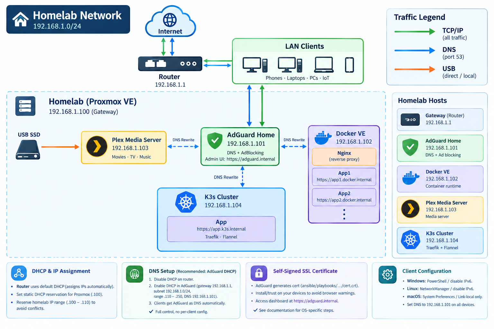
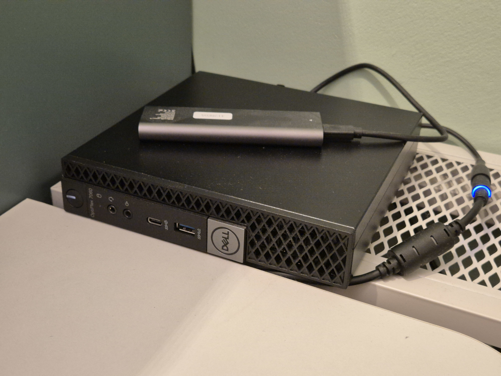

# Homelab
<p>
  
  
  
</p>





Proxmox VE homelab managed with Terraform and Ansible, driven by
[mise](https://mise.jdx.dev). A single `mise run all` provisions infrastructure, configures hosts,
and deploys apps.

## Quick Start

```bash
# 1. Install mise once
curl https://mise.run | sh

# 2. Install the pinned toolchain (Python, Terraform, kubectl, Helm, helmfile, Bitwarden CLI)
mise install

# 3. Full deployment
mise run all
```

`mise run all` is the whole deployment, from empty disks to deployed apps. It is safe to re-run —
every step is idempotent — but for day-to-day work prefer the individual tasks below.

Before step 3 you need two config files. `mise run setup` (or `mise run vault-create` +
`mise run terraform-tfvars`) creates them from templates, imports your SSH key and the HCP
Terraform token from Bitwarden, and installs the local Docker client:

```bash
mise run setup
$EDITOR terraform/terraform.tfvars       # Proxmox credentials
$EDITOR ansible/group_vars/all/vault.yml # secrets, admin_username must match tfvars
```

Then `mise run all`, and finally the service logins:

```bash
mise run headlamp-token        # Headlamp  (Kubernetes dashboard)
mise run monitoring-password   # Grafana   (monitoring stack)
```

## Tasks

Every task lives in [`.mise.toml`](.mise.toml) and runs from the repo root. `mise run <task>`
lists them with their descriptions; `mise <task>` is shorthand for the same thing.

```bash
mise run all                  # full deployment: disks, Terraform, Ansible, local tools, k3s apps
```

### Setup

```bash
mise run setup                # full local bootstrap (toolchain, Docker, SSH key, HCP token, venv, collections, templates)
mise run tools                # mise install + print the resolved version of each tool
mise run install-docker-local # install Docker Engine locally (Linux/WSL2)
mise run ssh-key              # fetch the homelab SSH key from Bitwarden, load it into ssh-agent
mise run terraform-auth       # fetch the HCP Terraform token from Bitwarden -> ~/.terraform.d
mise run setup-venv           # create ansible/.venv from the pinned Python + dependencies
mise run ansible-install      # install Ansible collections (re-runs when requirements.yml changes)
mise run vault-create         # copy vault.yml.template -> group_vars/all/vault.yml (skip if exists)
mise run terraform-tfvars     # copy terraform.tfvars.template -> terraform.tfvars (skip if exists)
```

### Terraform

```bash
mise run tf-init              # initialize Terraform
mise run tf-plan              # preview infrastructure
mise run tf-apply             # apply infrastructure
mise run tf-destroy           # destroy all infrastructure
```

### Ansible

```bash
mise run ansible-all          # all playbooks (adguard + docker + plex + k3s)
mise run ansible-adguard      # deploy AdGuard Home
mise run ansible-docker       # deploy Docker host
mise run ansible-plex         # deploy Plex Media Server
mise run ansible-k3s          # deploy K3s single-node (192.168.1.104)
mise run ansible-pve          # mount external USB disks on Proxmox
mise run ansible-pve-host     # configure the Proxmox host for the plex LXC (GPU passthrough)
mise run ansible-dry-run      # check mode, all playbooks
```

### Local machine

```bash
mise run wait-for-vms         # wait for the Docker/K3s VMs to finish booting and cloud-init
mise run ssh-cleanup          # remove stale SSH host keys (.100, .102, .104)
mise run ssh-accept-keys      # accept SSH host keys (.100, .102, .104)
mise run docker-context       # remote Docker context "homelab" (DOCKER_USER from .mise.toml)
mise run kubectl-config       # wire ~/.kube/config from the fetched k3s.yaml (127.0.0.1 -> 192.168.1.104)
mise run helm-diff            # install the helm-diff plugin, verified against the cluster
mise run clean                # remove ansible/.venv and the dependency stamp
```

### K3s apps

```bash
mise run apps-diff            # show what would change for every release in apps/k3s/helmfile.yaml
mise run apps                 # install/upgrade every release in apps/k3s/helmfile.yaml (idempotent)
mise run apps-list            # list the releases declared in apps/k3s/helmfile.yaml
mise run apps-destroy         # uninstall every release in apps/k3s/helmfile.yaml
```

### Service logins

Credentials are not stored in the repo — read them out of the cluster:

```bash
mise run headlamp-token       # Headlamp login token, valid 24h
mise run monitoring-password  # generated Grafana admin password
```

| Service | URL | Login |
|---------|-----|-------|
| Headlamp | `https://dashboard.k3s.skoltun.dev` | paste the `headlamp-token` output |
| Grafana | `https://grafana.k3s.skoltun.dev` | user `admin`, password from `monitoring-password` |
| Prometheus | `https://grafana-prometheus.k3s.skoltun.dev` | none |
| AdGuard Home | `https://adguard.skoltun.dev` | `admin_username` + password from `vault.yml` |
| Plex | `http://192.168.1.103:32400/web` | claim once, then your Plex account |

`mise run all` ends with `mise run apps`, which prints the first three URLs together with the tasks
that produce the credentials.

> `mise run all` runs, in order: `ansible-install` → `ssh-cleanup` → `ssh-accept-keys` →
> `terraform-auth` → `tf-init` → `tf-apply` → `wait-for-vms` → `ansible-pve` → `ansible-pve-host` →
> `ansible-all` → `docker-context` → `kubectl-config` → `helm-diff` → `apps`. Manual
> `mise run ansible-*` runs also accept host keys first (`ssh-accept-keys` covers .100, .102, .104);
> `ssh-cleanup` only happens inside `all`, so run it by hand after a VM rebuild.

`kubectl`, `helm`, `helmfile`, `terraform` and `python` are not installed globally — they are pinned
in [`.mise.toml`](.mise.toml), and mise tasks always run with those versions in `PATH`, even in a
shell where `mise activate` never ran. For one-off commands outside a task use `mise exec -- ...`.
See [Prerequisites](#prerequisites).

## Infrastructure

| Host | Type | IP | Purpose |
|------|------|----|---------|
| pve (Proxmox) | Host | 192.168.1.100 | Proxmox VE host (API + LXC transport) |
| adguard | LXC (Debian 13) | 192.168.1.101 | DNS ad blocking (AdGuard Home) |
| docker | VM (Ubuntu 24.04) | 192.168.1.102 | Container runtime (Docker + proxy-net) |
| plex | LXC (Debian 13) | 192.168.1.103 | Plex Media Server (media + config on USB SSD) |
| k3s | VM (Ubuntu 24.04) | 192.168.1.104 | K3s single-node (Traefik + Flannel, `terraform/modules/k3s_vm`) |
| gateway | Router | 192.168.1.1 | Network gateway |

Subnet: `192.168.1.0/24` · Tags: `management-plane` + `role-adguard`/`role-docker`/`role-plex`/`role-k3s`. See [Local Network Setup](docs/network-setup.md) for DHCP/DNS details. K3s kubeconfig is fetched to `ansible/playbooks/files/k3s.yaml` and wired locally via `mise run kubectl-config`.

## Apps

Two mechanisms, no others:

- **Docker Compose** on the Docker VM — add `apps/docker/<name>/docker-compose.yml`, attached to the
  external `proxy-net` bridge, routed by `VIRTUAL_HOST` under the `*.docker.skoltun.dev` wildcard.
- **Helmfile** on K3s — add a release to `apps/k3s/helmfile.yaml` with overrides in
  `apps/k3s/<name>/values.yaml`, then `mise run apps`.

See [Apps](apps/README.md) for how to add, deploy, scope, and retire either kind.

## Documentation

- [Initial Setup](docs/setup.md) - Prerequisites, Proxmox config, first deployment, troubleshooting
- [Local Network Setup](docs/network-setup.md) - DNS configuration, client setup, trusting the AdGuard TLS certificate, troubleshooting
- [Ansible](ansible/README.md) - Playbooks, vault, TLS cert, Docker network
- [Apps](apps/README.md) - Adding and deploying apps with Docker Compose or helmfile

## Prerequisites

- [mise](https://mise.jdx.dev/getting-started.html) — the only tool you install yourself. It manages
  everything else from [`.mise.toml`](.mise.toml); `mise install` fetches the pinned versions.
- Bitwarden CLI + an unlocked vault — `mise run setup` reads two items from it: `homelab-ssh-key`
  (written to `~/.ssh/id_ed25519`) and `hcp-terraform-token` (its notes become the HCP API token).
  Set `BW_SESSION` to skip the interactive unlock, and note that `terraform-auth` is interactive.
- `jq` and OpenSSH — used by the `ssh-key` and `terraform-auth` tasks.
- Proxmox VE host reachable at `192.168.1.100:8006`
- Docker >= 24.0 — installed for you on Linux/WSL2 by `mise run install-docker-local`; the Docker VM
  is the runtime, so this is only the local client plus the remote `homelab` context.
- Ansible Core >= 2.14 — installed into `ansible/.venv` by `mise run setup-venv`, no global install
  needed. Activate it with `source ansible/.venv/bin/activate` to run `ansible-playbook` directly.

Pinned in [`.mise.toml`](.mise.toml) and installed by `mise install`:

| Tool | Version |
|------|---------|
| Python | 3.12 |
| Terraform | 1.16 |
| kubectl | 1.37.1 |
| Helm | 4.3.0 |
| helmfile | 1.8.0 |
| Bitwarden CLI | latest |

`mise run kubectl-config` wires `~/.kube/config` and fails if the cluster is unreachable; `mise run
helm-diff` installs the mandatory `helm-diff` plugin from its release tarball and verifies cluster
access. Neither needs sudo.

To use a different tool version, edit `.mise.toml` (or `mise use helm@3.22.0`) and re-run
`mise install`.

Versions tested: Terraform 1.16.x, kubectl `v1.37.1` against server `v1.36.4+k3s1`, Helm `v4.3.0`,
helmfile `1.8.0`, helm-diff `3.15.15`.

Provider/collections pinned: `bpg/proxmox 0.108.0` (`terraform/providers.tf:5`, `terraform/.terraform.lock.hcl:5`), `ansible.posix 2.2.0`, `community.docker 5.2.1`, `community.general 13.0.1`, `community.proxmox 2.0.0` (`ansible/requirements.yml:1`).
