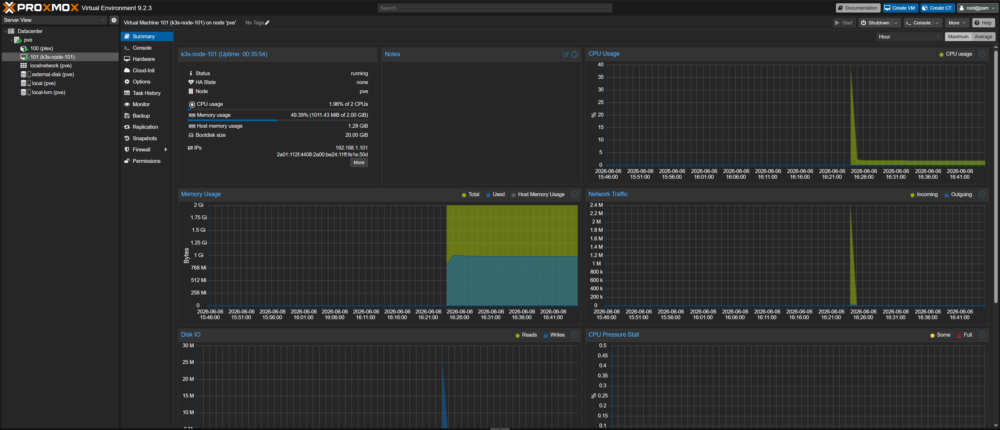

# Terraform Proxmox VM Module

This project completely automates Proxmox VM lifecycle management using the modern `bpg/proxmox` provider. 

* **Downloads Cloud Images:** Automatically pulls cloud images (default: Ubuntu 24.04 LTS) straight to Proxmox storage.
* **Generates & Uploads Cloud-Init:** Dynamically builds Cloud-Init user-data and pushes it as a snippet via SFTP/SSH before boot.
* **Provisions the VM:** Creates the VM, attaches the cloud image, binds network interfaces, and injects the Cloud-Init configuration.
* **Injects SSH Keys:** Binds your local public key (`~/.ssh/id_ed25519`) into the guest OS for instant, passwordless `ssh` access on completion.


Once the deployment is complete and the virtual machine boots up, you can find its IP address in the Proxmox WebUI under the VM's **Summary** tab:


---

## 🛠️ Prerequisites and Proxmox Preparation

Before running the script, you must properly configure privileges and SSH access within your Proxmox web interface.

### Step 1: Creating a User and Permissions
1. Log in to the Proxmox WebUI as `root@pam`.
2. Navigate to **Datacenter** -> **Permissions** -> **Users** and click **Add**.
   * **User name:** `terraform`
   * **Realm:** `pve`
3. Go to the **Permissions** tab and grant the user an appropriate role on the path `/` (the entire cluster), containing the following privileges: 
   * `PVEAdmin`
   * `Sys.Modify`, `Sys.Audit`, `Datastore.Allocate`, `Datastore.AllocateSpace`

### Step 2: Generating an API Token
1. In the WebUI, navigate to **Datacenter** -> **Permissions** -> **API Tokens** and click **Add**.
   * **User:** `terraform@pve`
   * **Token ID:** `terraform-token`
   * *Optional:* Uncheck *Privilege Separation*.
2. Copy the generated **Token Secret** and **Token ID** – they will be required for the `terraform.tfvars` file.

### Step 3: SSH Key and Storage Permissions (Required for SFTP/Cloud-Init)
The Terraform provider requires direct SSH access to the Proxmox host to upload Cloud-Init configuration files to the `snippets` directory.
1. Ensure that your local **public key** is added to the Proxmox host in the `/root/.ssh/authorized_keys` file.
2. Provide the path to your local **private key** (e.g., `~/.ssh/id_ed25519` or `C:/Users/user/.ssh/id_rsa`) in the Terraform configuration.
3. **Important for Snippets:** If you are using a specific storage for your snippets (for example, the default `local` storage), make sure that **Snippets** are enabled in its content types. Navigate to **Datacenter** -> **Storage** -> select your storage (e.g., `local`) -> click **Edit**, and ensure **Snippets** is selected in the **Content** dropdown list.

---

### 🔑 Accessing the VM
Once the deployment is complete and the virtual machine boots up, you can log in to it via SSH.

Cloud-Init automatically provisions the VM with the same SSH key defined in your Terraform variables (by default paths like ~/.ssh/id_ed25519 or ~/.ssh/id_rsa).

To connect from your local machine, use the configured username and the VM's IP address:

```Bash
ssh -i ~/.ssh/id_ed25519 username@vm_ip_address
```